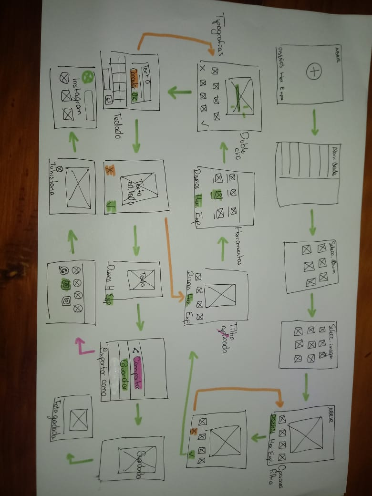

1. Visibilidad del estado del sistema: el sistema siempre debería mantener informados 
   a los usuarios de lo que está ocurriendo, a través de retroalimentación apropiada 
   dentro de un tiempo razonable.

* Esta es la razón por la cual Snapseed es mi aplicación de edición de fotos favorita, 
  a comparación de otras te deja saber en cada momento qué estás realizando dentro del 
  proceso de edición. 

2. Relación entre el sistema y el mundo real: el sistema debería hablar el lenguaje de 
   los usuarios mediante palabras, frases y conceptos que sean familiares al usuario, más 
   que con términos relacionados con el sistema. Seguir las convenciones del mundo real, 
   haciendo que la información aparezca en un orden natural y lógico.

* El lenguaje usado es sumamente sencillo, lo cual logra que el asimilar la información 
  presentada y los pasos a seguir sean intuitivos. 

3. Control y libertad del usuario: hay ocasiones en que los usuarios elegirán las funciones 
   del sistema por error y necesitarán una “salida de emergencia” claramente marcada para dejar 
   el estado no deseado al que accedieron, sin tener que pasar por una serie de pasos. Se deben 
   apoyar las funciones de deshacer y rehacer.

* Las acciones de deshacer se encuentran claramente marcadas, más sin embargo, en algunas ocasiones
  no resultan en la acción deseada, ya que regresas a etapas anteriores del proceso de edición.

4. Consistencia y estándares: los usuarios no deberían cuestionarse si acciones, situaciones o 
   palabras diferentes significan en realidad la misma cosa; siga las convenciones establecidas.

* Las convenciones son consistentes a lo largo de la interfaz, acompañadas de gráficos representativos
  que hacen más sencillo su entendimiento. 

5. Prevención de errores: mucho mejor que un buen diseño de mensajes de error es realizar un diseño 
   cuidadoso que prevenga la ocurrencia de problemas.

* Gran parte de la prevención de errores, a mi parecer, se centra en la segmentación de los pasos a 
  llevar a cabo para lograr la edición deseada, lo cual hace más asimilable y amigable todo el proceso.

6. Reconocimiento antes que recuerdo: se deben hacer visibles los objetos, acciones y opciones. 
   El usuario no tendría que recordar la información que se le da en una parte del proceso, para seguir 
   adelante. Las instrucciones para el uso del sistema deben estar a la vista o ser fácilmente 
   recuperables cuando sea necesario.

* Las opciones son claras, visibles, se encuentran en los mismos lugares a lo largo de la interacción
  lo cual facilita la edición. 

7. Flexibilidad y eficiencia de uso: la presencia de aceleradores, que no son vistos por los 
   usuarios novatos, puede ofrecer una interacción más rápida a los usuarios expertos que la que 
   el sistema puede proveer a los usuarios de todo tipo. Se debe permitir que los usuarios adapte 
   el sistema para usos frecuentes.

* Esta es una de mis características preferidas de la aplicación, al principio puede tomar unos segundos
  comprender el flujo que debes seguir para obtener el resultado deseado, pero habiéndola usado 2 veces 
  puedo lograr la edición que quiero de manera casi automática, ya que también permite guardar ediciones 
  pasadas para aplicarlas a nuevas fotografías. 

8. Estética y diseño minimalista: los diálogos no deben contener información que es irrelevante 
   o poco usada. Cada unidad extra de información en un diálogo, compite con las unidades de información 
   relevante y disminuye su visibilidad relativa.

* El uso de gráficos y textos puede resultar excesivo en un inicio, pero me parece relevante para 
  comprender cada una de las herramientas que ofrece la aplicación, aunque me encantaría poder cambiar el
  diseño de acuerdo a mis preferencias. 

9. Ayudar a los usuarios a reconocer, diagnosticar y recuperarse de errores: los mensajes de error se 
   deben entregar en un lenguaje claro y simple, indicando en forma precisa el problema y sugerir una 
   solución constructiva al problema.

* Este es uno de mis pain points, el hecho de que no aparezcan mensajes de error, simplemente te devuelvan 
  a una fase de la edición previa al error cometido, me parece un punto a prestar atención. 

10. Ayuda y documentación: incluso en los casos en que el sistema pueda ser usado sin documentación, 
    podría ser necesario ofrecer ayuda y documentación. Dicha información debería ser fácil de buscar, 
    estar enfocada en las tareas del usuario, con una lista concreta de pasos a desarrollar y no ser 
    demasiado extensa.

* Creo que podría ser útil, aunque su uso resulta intuitivo y sencillo desde la primera vez, pero podría
  ofrecer más información para poder obtener mayor conocimiento sobre nuevas herramientas de edición y las 
  diferentes maneras en las cuales podemos usarlas. 

Snapseed es una aplicación de edición de fotografías producida por Nik Software, ahora propiedad de Google, 
para iOS y Android que permite a los usuarios mejorar fotos y aplicar filtros digitales.

### Aprendizajes

* Ya que ambas herramientas nos ayudarán a comunicarnos con el equipo de desarrollo la claridad    es primordial, por esto es importante prestar atención a la simbología usada para representar    los diferentes elementos del user flow y el flow chart, de manera que cada elemento se           diferencie, así como la acción que lleva a cabo. Lecturas al respecto: 

[Journey maps and user flows](https://medium.com/sketch-app-sources/user-journey-maps-or-user-flows-what-to-do-first-48e825e73aa8)

[UI flows](https://signalvnoise.com/posts/1926-a-shorthand-for-designing-ui-flows)

[Smooth UX](https://www.uxpin.com/studio/blog/creating-perfect-user-flows-for-smooth-ux/)

[Interaction flows](https://uxplanet.org/an-introduction-to-interaction-flows-a4f783402529)

[Site flows and user flows](http://uxmovement.com/wireframes/site-flows-vs-user-flows-when-to-use-which/)

[UX Glossary](https://uxplanet.org/ux-glossary-task-flows-user-flows-flowcharts-and-some-new-ish-stuff-2321044d837d)

[User flow](https://uxknowledgebase.com/user-flow-496e3187842)

* Al realizar este ejercicio pude comprender la importancia de la investigación y el análisis de   la información obtenida para generar un flujo de usuario que resulte intuitivo y eficaz, lo      esencial que resulta conocer a nuestros usuarios, delimitarlos, no podemos diseñar para todos.

* Llama mi atención las herramientas que ofrece esta aplicación y la forma en la que se llevó a    cabo la arquitectura de la información dentro de la interfaz, lo cual se refleja en un flujo     intuitivo, que no genera frustración. 

* Disfruté mucho realizar este ejercicio, fue un proceso muy enriquecedor que podré poner en       práctica para aprender de los pain y gain points de cada aplicación que use en el futuro. 